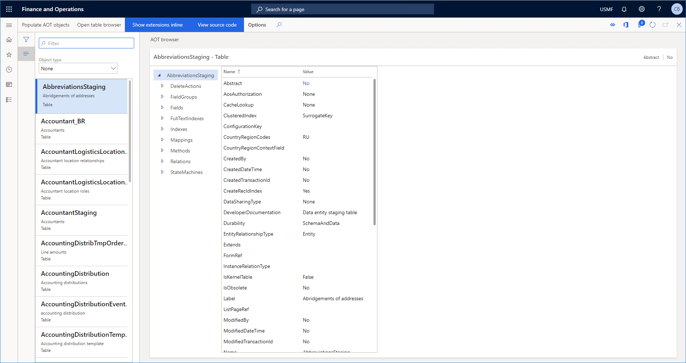

# AOT Browser
Dynamics 365 for Finance and Operations AOT Browser

### Download
[Releases](https://github.com/arbelatech/aotbrowser/releases)

### What is the AOT Browser?
In Dynamics AX 2012 and earlier it was possible for power users to be able to open and browse the contents of the AOT
(Application Object Tree) from the UI. This functionality was removed in Dynamics 365 for Finance and Operations as all
development is now done in Visual Studio. This means that in order to browse the contents of the AOT, one now needs access
to a development environment with Visual Studio.

**AOT Browser to save the day!** With the AOT Browser it is now possible to browse the objects in the AOT from the D365FO web interface.

### How do I get to the AOT Browser?
In the D365FO web interface navigate to Common > Common > AOT browser

### More documentation to come!
We will be working on creating more documentation to describe all of the features of the AOT browser, but for now you can take it for a spin by going to the above path.

